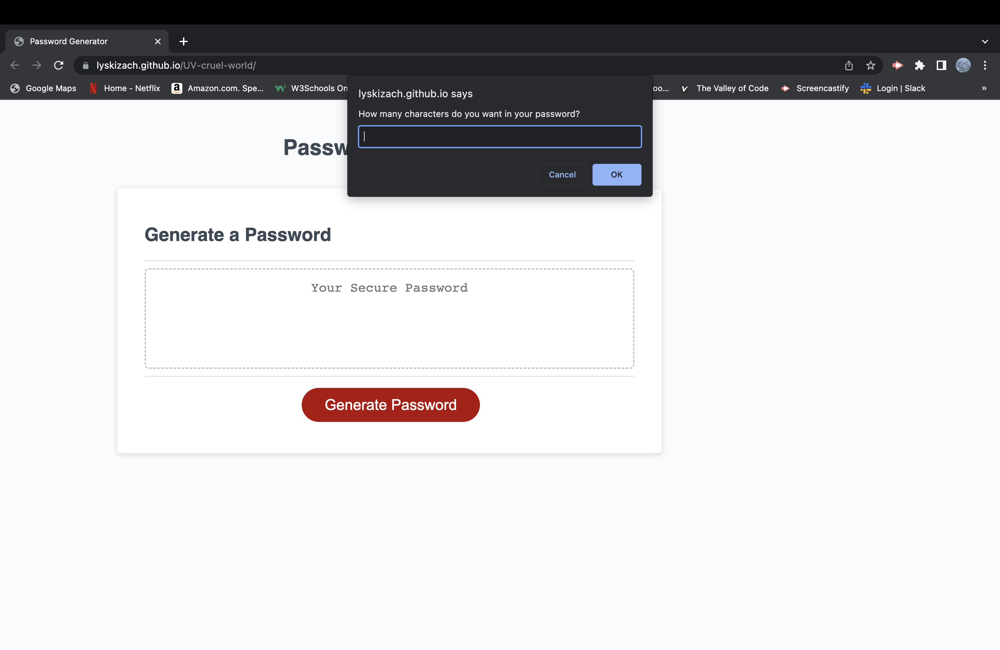

# Random Password Generator

In this challenge, I modified the starter code to create a fully operational random password generator. The purpose was to integrate my knowledge of Javascript. This repo was made for employees with acess to sensitive data, to create a password with greater security.

P.S. All my commits are within this short time because I originally forked the starter code and was working within my own repo there. There is some discrepency sometimes of what is said in class vs. what bootcampspot says. Unless advised otherwise I will follow the instructions on bootcampspot to the letter...

## Screenshot of Deployed Link

## URL
https://lyskizach.github.io/UV-cruel-world/